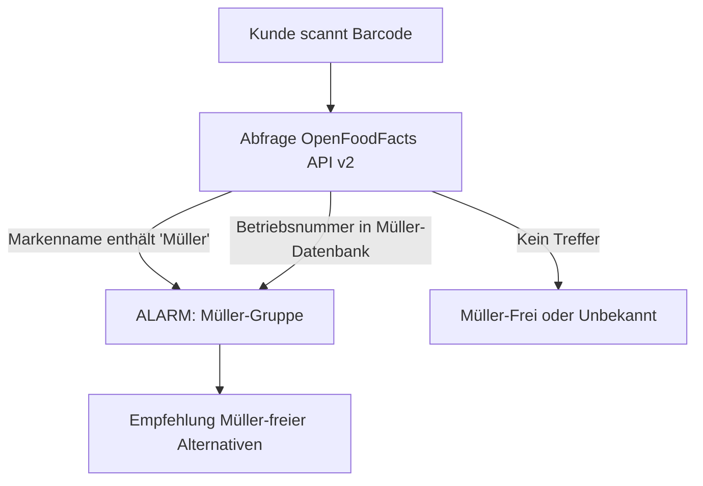

# 🥛 Müller-Fascho-Buster — Konsum-Boykott-Scanner

**Müller-Fascho-Buster** ist eine datenschutzfreundliche, clientseitige Web-App im edlen Glassmorphic-Dark-Mode, mit der Verbraucher im Supermarkt sofort prüfen können, ob ein Produkt in Verbindung zur **Unternehmensgruppe Theo Müller** steht. 

Mit nur einem Scan entlarven Sie Marken wie **Müllermilch**, **Weihenstephan**, **Landliebe**, **Sachsenmilch** sowie verdeckte Eigenmarken von Discountern!

👉 **Live-Anwendung:** [https://github.com/kolkrabeofdoom/mueller-fascho-buster](https://github.com/kolkrabeofdoom/mueller-fascho-buster)

---

## 🧐 Warum Müller boykottieren? (Hintergrund)

Die Kritik an Theo Müller und der *Unternehmensgruppe Theo Müller (UTM)* ist vielschichtig:
*   **Politische Verstrickungen:** Theo Müller pflegt nach eigenen Angaben engen Kontakt zur Führungsriege der rechtsextremen **AfD** (unter anderem Treffen mit Bundessprecherin Alice Weidel). Er rechtfertigt dies als „rein informelles Interesse“, unterstützt jedoch rechtsextreme Akteure durch gesellschaftliche Legitimierung.
*   **Subventions-Abgreifung:** Bau von Megafabriken (z. B. Sachsenmilch Leppersdorf) mit Millionen an Steuergeldern und anschließender Abbau von Arbeitsplätzen an anderen Standorten.
*   **Steuerflucht:** Umzug des Firmensitzes und Theo Müllers Privatwohnsitzes in die Schweiz zur Einsparung von Erbschafts- und Einkommenssteuern in Deutschland.
*   **Druck auf die Landwirtschaft:** Monopolstellung und aggressiver Preisdruck zwingen zahlreiche Milchbauern zur Betriebsaufgabe.

---

## ✨ Hauptfunktionen

*   📷 **Barcode-Scanner (Kamera):** Schneller Scan von 13-stelligen EAN-Codes direkt im Supermarkt über die Smartphone-Kamera (unterstützt durch die leistungsfähige `html5-qrcode` Bibliothek).
*   🔢 **Manuelle Barcode-Suche:** Option zur manuellen Eingabe des EAN-Codes, falls kein Kamerazugriff möglich ist.
*   🔎 **Müller-Werk-Stempel-Checker:** Discounter-Eigenmarken (z. B. von Aldi, Lidl, Netto) verbergen oft ihren wahren Hersteller. Der integrierte Stempel-Checker gleicht das **ovale EU-Identitätskennzeichen** (z. B. `DE SN 016 EG`) direkt mit allen bekannten Betriebsstätten der Müller-Gruppe ab!
*   🔄 **Echtzeit-Abgleich (OpenFoodFacts API v2):** Direkte Anbindung an die weltgrößte offene Lebensmittel-Datenbank mit robustem Fallback-Handling für nicht gelistete Produkte.
*   🛡️ **Unabhängige Alternativen:** Bei einem Treffer schlägt die App sofort Müller-freie Molkerei-Alternativen vor (z. B. *Berchtesgadener Land*, *Schwarzwaldmilch*, *Andechser Natur* sowie pflanzliche Produkte von *Oatly* oder *Alpro*).
*   📜 **Lokale Scan-Historie:** Ihre letzten 25 Scans werden ausschließlich lokal im Browser-Speicher (`localStorage`) gesichert und können jederzeit gelöscht werden.
*   🏢 **Konzern-Showcase:** Eine bildschöne, interaktive Übersicht aller Submarken und Betriebsstätten des Müller-Konzerns.

---

## 🛠️ Technische Details & Architektur

Die App läuft **zu 100 % im Browser** und benötigt kein Tracking-Backend. Das garantiert absolute Privatsphäre beim Einkaufen.

*   **Framework:** React 19 + TypeScript + Vite
*   **Styling:** Custom CSS mit modernen HSL-Variablen, Glassmorphismus-Effekten (`backdrop-filter`) und responsiven Rastern für Mobilgeräte.
*   **Icon-Bibliothek:** `lucide-react`
*   **API:** OpenFoodFacts v2 API (`https://world.openfoodfacts.org/api/v2/product/{barcode}`)



---

## 🚀 Installation & Lokaler Start

### Voraussetzungen
*   **Node.js** (v18.x oder höher empfohlen)
*   **npm** oder **yarn**

### Schritt 1: Repository klonen
```bash
git clone https://github.com/kolkrabeofdoom/mueller-fascho-buster.git
cd mueller-fascho-buster
```

### Schritt 2: Abhängigkeiten installieren
```bash
npm install
```

### Schritt 3: Entwicklungs-Server starten
```bash
npm run dev
```
Die Anwendung ist nun unter **`http://localhost:5173/`** erreichbar.

### Schritt 4: Produktions-Build erstellen
```bash
npm run build
```
Die optimierten, statischen Dateien befinden sich anschließend im Ordner `dist/`.

---

## 🤝 Mitwirken & Daten erweitern

Haben Sie ein Müller-Produkt entdeckt, das fälschlicherweise als "Müller-Frei" markiert wird, oder kennen Sie weitere Betriebsstätten? 

Ergänzungen können ganz einfach in der Datei `src/data/utmDatabase.ts` vorgenommen werden:
*   `utmBrands`: Liste der Konzernmarken
*   `utmPlants`: Liste der Betriebsstätten-Kennzeichen
*   `independentAlternatives`: Liste der empfohlenen Ersatzprodukte

Erstellen Sie gerne einen Pull-Request oder ein Issue!

---

## 📄 Lizenz & Datenschutz

*   **Lizenz:** MIT
*   **Datenschutz:** Die App erhebt keinerlei persönliche Daten. Alle Scans und Historien verbleiben auf Ihrem Endgerät im lokalen Speicher des Browsers.
*   **Datenquellen:** Produktinformationen stammen aus der kollaborativen Datenbank [OpenFoodFacts](https://de.openfoodfacts.org).
