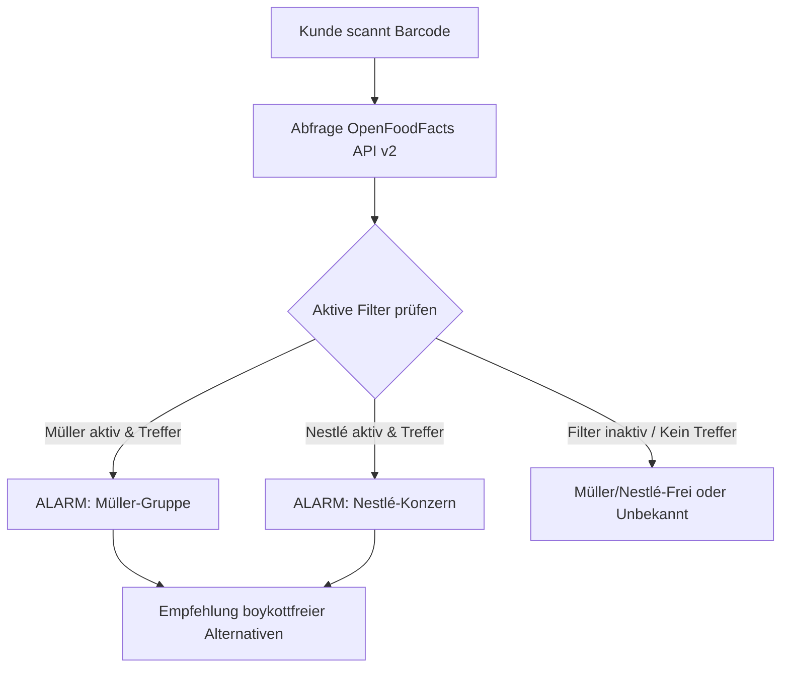

# 🥛 Boykott-Buster — Konsum-Boykott-Scanner

**Boykott-Buster** ist eine datenschutzfreundliche, clientseitige Web-App im edlen Glassmorphic-Dark-Mode, mit der Verbraucher im Supermarkt sofort prüfen können, ob ein Produkt in Verbindung zur **Unternehmensgruppe Theo Müller** oder dem **Nestlé-Konzern** steht. 

Mit nur einem Scan entlarven Sie Marken wie **Müllermilch**, **Weihenstephan**, **Landliebe**, **Wagner Pizza**, **Maggi**, **Thomy**, **San Pellegrino** sowie verdeckte Eigenmarken! Über interaktive Boykott-Filter lässt sich präzise steuern, welche Konzerne im Scan-Alarm berücksichtigt werden.

👉 **Live-Anwendung:** [https://github.com/kolkrabeofdoom/mueller-fascho-buster](https://github.com/kolkrabeofdoom/mueller-fascho-buster)

---

## 🧐 Warum Müller & Nestlé boykottieren? (Hintergrund)

Die Kritik an den beiden Konzernen ist vielschichtig und fundiert:
*   **Unternehmensgruppe Theo Müller (UTM):**
    *   **Politische Verstrickungen:** Theo Müller pflegt engen Kontakt zur Führungsriege der rechtsextremen **AfD** (Alice Weidel).
    *   **Subventions-Abgreifung:** Bau von Großanlagen mit Millionen an Steuergeldern und zeitgleicher Abbau regionaler Standorte.
    *   **Steuerflucht:** Verlagerung des Wohn- und Firmensitzes in die Schweiz zur Steuervermeidung in Deutschland.
    *   **Monopolisierung:** Aggressiver Preisdruck zwingt regionale Milchbauern zur Betriebsaufgabe.
*   **Nestlé-Konzern:**
    *   **Ressourcen-Ausbeutung:** Global umstrittene Privatisierung und Abfüllung von Grundwasser in Dürregebieten (Vittel, Perrier).
    *   **Umweltbelastung:** Einer der weltweit größten Plastikmüll-Erzeuger mit mangelnder Kreislaufwirtschaft.
    *   **Kinderarbeit & Ausbeutung:** Systematische Menschenrechtsverletzungen und ausbeuterische Kinderarbeit in Kakao-Lieferketten.
    *   **Aggressives Marketing:** Fragwürdige Vermarktung von Säuglingsnahrung in Entwicklungsländern.

---

## ✨ Hauptfunktionen

*   🛡️ **Interaktive Boykott-Filter:** Selektives Zu- und Abschalten von Müller und/oder Nestlé per Klick. Der Scan-Alarm reagiert nur auf aktive Filter!
*   📷 **Barcode-Scanner (Kamera):** Schneller Scan von EAN-Codes direkt im Markt über die Smartphone-Kamera (unterstützt durch die `html5-qrcode` Bibliothek).
*   🔢 **Manuelle Barcode-Suche:** Option zur manuellen Eingabe des EAN-Codes, falls kein Kamerazugriff möglich ist.
*   🔎 **Müller-Werk-Stempel-Checker:** Discounter-Eigenmarken (z. B. von Aldi, Lidl, Netto) verbergen oft ihren wahren Hersteller. Der integrierte Stempel-Checker gleicht das **ovale EU-Identitätskennzeichen** (z. B. `DE SN 016 EG`) mit allen Müller-Molkereien ab!
*   🔄 **Echtzeit-Abgleich (OpenFoodFacts API v2):** Direkte Anbindung an die weltgrößte offene Lebensmittel-Datenbank mit robustem Fallback-Handling.
*   🛡️ **Unabhängige Alternativen:** Bei einem Treffer schlägt die App sofort konzernfreie Alternativen vor (z. B. regionale Molkereien, Taifun Tofu für vegane Alternativen, Gustavo Gusto für Pizza, Fritz-Kola/unabhängiges Wasser).
*   📜 **Lokale Scan-Historie:** Ihre letzten 25 Scans werden ausschließlich lokal im Browser-Speicher (`localStorage`) gesichert und können jederzeit gelöscht werden.
*   🏢 **Konzern-Showcase:** Eine bildschöne, interaktive Übersicht aller Submarken und Betriebsstätten der boykottierten Konzerne.

---

## 🛠️ Technische Details & Architektur

Die App läuft **zu 100 % im Browser** und benötigt kein Tracking-Backend. Das garantiert absolute Privatsphäre beim Einkaufen.

*   **Framework:** React 19 + TypeScript + Vite
*   **Styling:** Custom CSS mit modernen HSL-Variablen, Glassmorphismus-Effekten (`backdrop-filter`) und responsiven Rastern für Mobilgeräte.
*   **Icon-Bibliothek:** `lucide-react`
*   **API:** OpenFoodFacts v2 API (`https://world.openfoodfacts.org/api/v2/product/{barcode}`)



---

## 🚀 Installation & Lokaler Start

### Voraussetzungen
*   **Node.js** (v18.x oder höher empfohlen)
*   **npm** oder **yarn**

### Schritt 1: Repository klonen
```bash
git clone https://github.com/kolkrabeofdoom/mueller-fascho-buster.git
cd mueller-fascho-buster
```

### Schritt 2: Abhängigkeiten installieren
```bash
npm install
```

### Schritt 3: Entwicklungs-Server starten
```bash
npm run dev
```
Die Anwendung ist nun unter **`http://localhost:5173/`** erreichbar.

### Schritt 4: Produktions-Build erstellen
```bash
npm run build
```
Die optimierten, statischen Dateien befinden sich anschließend im Ordner `dist/`.

---

## 🤝 Mitwirken & Daten erweitern

Haben Sie ein Müller-Produkt entdeckt, das fälschlicherweise als "Müller-Frei" markiert wird, oder kennen Sie weitere Betriebsstätten? 

Ergänzungen können ganz einfach in der Datei `src/data/utmDatabase.ts` vorgenommen werden:
*   `utmBrands`: Liste der Konzernmarken
*   `utmPlants`: Liste der Betriebsstätten-Kennzeichen
*   `independentAlternatives`: Liste der empfohlenen Ersatzprodukte

Erstellen Sie gerne einen Pull-Request oder ein Issue!

---

## 📄 Lizenz & Datenschutz

*   **Lizenz:** MIT
*   **Datenschutz:** Die App erhebt keinerlei persönliche Daten. Alle Scans und Historien verbleiben auf Ihrem Endgerät im lokalen Speicher des Browsers.
*   **Datenquellen:** Produktinformationen stammen aus der kollaborativen Datenbank [OpenFoodFacts](https://de.openfoodfacts.org).
