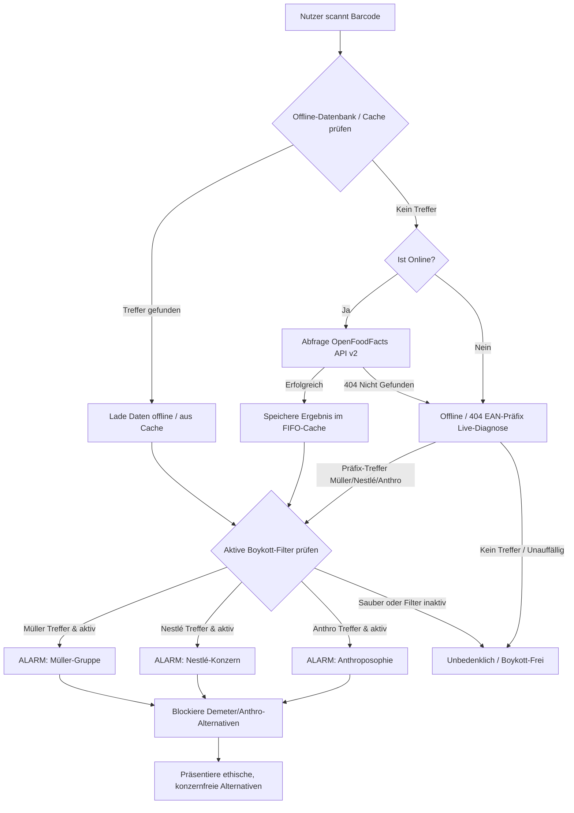

# 🥛 Boykott-Buster — Der ultimative Konsum-Filter

**Boykott-Buster** ist eine hochperformante, clientseitige Web-App im edlen Glassmorphic-Dark-Mode. Sie ermöglicht es Verbrauchern im Supermarkt, Lebensmittel und Drogerieartikel sekundenschnell zu überprüfen und fundierte Kaufentscheidungen zu treffen.

Die Anwendung deckt drei große Boykott-Dimensionen ab: die **Unternehmensgruppe Theo Müller (UTM)**, den **Nestlé-Konzern** sowie **Anthroposophie- & Demeter-Verflechtungen** (darunter dm-drogerie markt, Weleda, Alnatura und Dr. Hauschka). Über interaktive Schalter lässt sich das Kontrollprofil in Echtzeit anpassen.

👉 **GitHub Repository:** [https://github.com/kolkrabeofdoom/mueller-fascho-buster](https://github.com/kolkrabeofdoom/mueller-fascho-buster)

---

## 🧐 Warum boykottieren? (Die drei Dimensionen)

Die Kritik an den jeweiligen Akteuren basiert auf weitreichenden politischen, gesellschaftlichen und ökologischen Missständen:

### 1. 🥛 Unternehmensgruppe Theo Müller (UTM)
* **Rechtsextreme Kontroversen:** Theo Müller pflegt nach eigenen Angaben regelmäßigen Kontakt zur AfD-Spitzenpolitik (Alice Weidel) und verweigert die klare Abgrenzung von rechtsextremen Positionen.
* **Subventions-Abgreifung:** Schließung regionaler Traditions-Molkereien bei gleichzeitigem Bezug von Millionen an deutschen Steuergeldern für sächsische Megawerke (z. B. Leppersdorf).
* **Steuerflucht:** Umzug des Firmengründers in die Schweiz (Erlenbach ZH), um der deutschen Erbschaftsteuer zu entgehen.
* **Monopolismus:** Aggressive Preisunterbietung gefährdet die Existenz familiengeführter Landwirtschaften.

### 2. 🐦 Nestlé-Konzern
* **Wasserprivatisierung:** Abpumpen von Grundwasser in dürregefährdeten Regionen und Schwellenländern, um es als Premium-Flaschenwasser (Vittel, Perrier, San Pellegrino) teuer zu vermarkten.
* **Menschenrechtsverletzungen:** Systematisch ungelöste Probleme mit Kinderarbeit, Schuldknechtschaft und Ausbeutung in den westafrikanischen Kakao-Lieferketten (z. B. KitKat, Smarties).
* **Babymilch-Skandal:** Historisch und gegenwärtig aggressive Vermarktungspraktiken von Säuglingsmilchpulver in Entwicklungsländern ohne sauberen Wasserzugang.

### 🔮 3. Anthroposophie & Demeter
* **Esoterik & Pseudowissenschaft:** Die biodynamische Landwirtschaft (Demeter) und anthroposophische Medizin (Weleda, WALA/Dr. Hauschka) basieren auf den Lehren von Rudolf Steiner. Diese verlangen unwissenschaftliche Praktiken (z. B. das Eingraben von Mist in Kuhhörnern nach Sternenkonstellationen) und entbehren oft empirischer Nachweise.
* **Problematisches Weltbild:** Rudolf Steiners Schriften beinhalten rassistische, antisemitische und deterministische Thesen über die Reinkarnationsstufen menschlicher Seelen.
* **Intransparente Geldflüsse:** Riesenumsätze von Alnatura oder Weleda fließen über Stiftungsnetzwerke verdeckt in die Alimentierung esoterischer Waldorf- und anthroposophischer Einrichtungen.
* **Konzern-Verwebung:** dm-Gründer Götz Werner konzipierte dm-drogerie markt explizit nach Steiners "sozialer Dreigliederung" und verankerte anthroposophische Führungsprinzipien dauerhaft im Management.

---

## ✨ Premium-Funktionen auf einen Blick

### 🛡️ 1. Dynamisches Drei-Filter-System
Nutzer können Müller-Gruppe, Nestlé und Anthroposophie unabhängig voneinander per Klick aktivieren oder deaktivieren.
* Der Scan-Alarm und die Detailansicht reagieren präzise auf die gewählten Filter.
* **Intelligenter Alternativen-Filter:** Bei einem Treffer schlägt die App sofort hochqualitative, unabhängige Alternativen vor (z. B. *Berchtesgadener Land*, *Tony's Chocolonely*, *lavera*, *Speick*). Anthroposophische oder Demeter-Marken (wie Alnatura, Weleda, Wala, dm-Eigenmarken) werden **automatisch blockiert** und niemals als Empfehlung ausgesprochen!

### 📊 2. "Mein Score" Glassmorphic Dashboard
Ein visuelles Highlight mit Echtzeit-Statistiken zu deinem bewussten Einkauf:
* **Buster-Score Circular Ring:** Ein glühender, animierter HSL-Fortschrittsring zeigt die prozentuale "Reinheit" deiner gescannten Produkte.
* **Dynamic Motivational Quotes:** Kontextbezogene Einschätzungen basierend auf deinem Score-Ergebnis spornen dich an, den Einkaufswagen sauberer zu halten.
* **Unlockable Achievements:** Ein edles System aus freischaltbaren Abzeichen und Medaillen (z. B. *Ersttäter*, *Müller-Buster*, *Nestlé-Jäger*, *Schattenboxer*, *Reinheitsgebot*, *Boykott-Meister*) belohnt deinen ethischen Konsum.

### 🔎 3. Stempel-Checker (Genusstauglichkeitskennzeichen)
Discounter-Eigenmarken (z. B. Milbona, ja!, Gut & Günstig) verschleiern oft, wer sie wirklich herstellt. Auf Milch- und Molkereiprodukten ist gesetzlich ein ovaler Stempel aufgedruckt.
* Der Stempel-Checker gleicht diese EU-Betriebsnummern (z. B. `DE SN 016 EG` für Sachsenmilch Leppersdorf) direkt ab und entlarvt verdeckte Müller-Ware im Nu!

### 💾 4. Offline-Scanning & FIFO-Caching
Um im Supermarkt auch bei schlechtem Netz voll funktionsfähig zu bleiben:
* **Curated Offline Database:** Eine integrierte Datenbank der beliebtesten Müller-, Nestlé- und Anthroposophie-Produkte ermöglicht die Sofort-Erkennung ganz ohne Mobilnetz.
* **FIFO-Rolling Cache:** Online erfolgreich abgerufene Produktdaten werden automatisch lokal zwischengespeichert. Um den Speicherplatz deines Smartphones zu schonen, arbeitet der Cache nach dem First-In-First-Out-Prinzip und ist streng auf maximal 100 Einträge begrenzt.
* **100% Client-Side Privacy:** Keine Server-Logs, kein Tracking, kein Profiling. Alle Daten und Verläufe verbleiben verdeckt und sicher in deinem lokalen Browser-Speicher (`localStorage`).

### 🍏 5. Saison-Buster (Saisonaler Einkaufshelfer)
Indem du frisches, regionales Freilandgemüse, Kräuter und Obst direkt auf Bauernmärkten kaufst, meidest du industriell verarbeitete Lebensmittel vollständig. Das entzieht Konzern-Monopolen jegliche Macht und schützt das Klima!
* **Interaktiver Saisonaler Kalender:** Ein eleganter, horizontal scrollbarer Monats-Wähler (Januar bis Dezember) zeigt sofort an, welche regionalen Produkte gerade Saison haben.
* **Detaillierte Anbaustufen-Filter:** Filtere blitzschnell nach Gemüse, Obst und Kräutern sowie den Anbaumethoden (frisches Freiland, Lagerware oder geschützter Anbau).
* **Wertvolle Einkaufs- und Küchentipps:** Jedes der 28+ hinterlegten mitteleuropäischen Erzeugnisse verfügt über fundierte Kaufhinweise und kulinarische Verzehrtipps.
* **Premium Glassmorphic Design:** Jede Kategorie leuchtet im HSL-Farbdesign (z.B. Freiland mit neon-grünem Glow, Lagerware mit warmem Gold-Glow, geschützter Anbau mit Cyan-Glow).

### 🔍 6. EAN-Teilbereichs-Scanner & Live-Diagnose
Für unbekannte Produkte oder im Offline-Fall bietet der integrierte EAN-Prefix-Scanner einen unvergleichlichen Schutz, bevor überhaupt eine API-Abfrage stattfindet:
* **Echtzeit-Diagnose:** Schon während des Tippens einer EAN-Barcode-Nummer analysiert die App das Länderpräfix des GS1-Registers (z.B. Deutschland 🇩🇪, Österreich 🇦🇹, Schweiz 🇨🇭, Frankreich 🇫🇷) und blendet eine informative Länderkarte ein.
* **Hersteller-Teilbereichs-Warnung:** Der Scanner gleicht die Ziffernfolgen mit bekannten Hersteller-Bereichen ab (z.B. Müller/Weihenstephan `4002631`, Landliebe `4025130`, Nestlé/Maggi `761303`, Alnatura `410442`, dmBio `4058172`, Weleda `4001638`).
* **Intelligenter 404- & Offline-Fallback:** Sollte OpenFoodFacts ein Produkt nicht kennen oder kein Netz vorhanden sein, liefert das System eine fundierte Verdachtswarnung anstelle einer nutzlosen "Nicht gefunden"-Meldung.

---

## 🛠️ Technische Details & Architektur

Die Web-App arbeitet vollständig ohne Server-Backend. Das Frontend kommuniziert direkt mit der OpenFoodFacts API v2.

* **Kerntechnologien:** React 19 + TypeScript + Vite
* **Styling:** Custom CSS mit modernstem Design (glassmorphe Transparenzen, `backdrop-filter`, HSL-Glow-Ringe, weiche Farbverläufe und volles Responsive Design für Smartphones).
* **Icon-Bibliothek:** `lucide-react`
* **Kamera-Bibliothek:** `html5-qrcode`

### 🔄 System-Ablaufdiagramm



---

## 🚀 Installation & Lokaler Start

### Voraussetzungen
* **Node.js** (v18.x oder höher empfohlen)
* **npm** (wird standardmäßig mit Node.js ausgeliefert)

### 1. Repository klonen & Verzeichnis betreten
```bash
git clone https://github.com/kolkrabeofdoom/mueller-fascho-buster.git
cd mueller-fascho-buster
```

### 2. Abhängigkeiten installieren
```bash
npm install
```

### 3. Entwicklungs-Server starten
```bash
npm run dev
```
Öffne anschließend **`http://localhost:5173/`** in deinem Browser. Für die Kamera-Nutzung am Smartphone muss die Seite über eine HTTPS-Verbindung oder localhost aufgerufen werden.

### 4. Produktionsbereiten Build generieren
```bash
npm run build
```
Die optimierten, statischen Assets werden im Verzeichnis `dist/` abgelegt und können direkt auf jedem statischen Webspace (z. B. GitHub Pages, Vercel, Netlify) gehostet werden.

---

## 🤝 Mitwirken & Erweiterung

Wenn du neue Müller-Betriebsstätten kennst, neue Marken hinzufügen willst oder bessere ethische Alternativen vorschlagen möchtest, kannst du die zentrale Datenbank ganz einfach erweitern:

* **Datei:** `src/data/utmDatabase.ts`
  * `utmBrands`: Liste der Boykott-Marken (Müller, Nestlé, Anthroposophie)
  * `utmPlants`: Liste der Genusstauglichkeitskennzeichen
  * `independentAlternatives`: Liste der empfohlenen Ersatzprodukte
  * `offlineProducts`: Populäre Barcodes für die Offline-Nutzung

---

## 📄 Lizenz & Datenschutz

* **Lizenz:** MIT
* **Datenschutz:** Der Schutz deiner Privatsphäre ist absolut. Scans, Statistiken und dein Score werden ausschließlich lokal im Browser berechnet und gespeichert. Es findet keinerlei Tracking statt.
